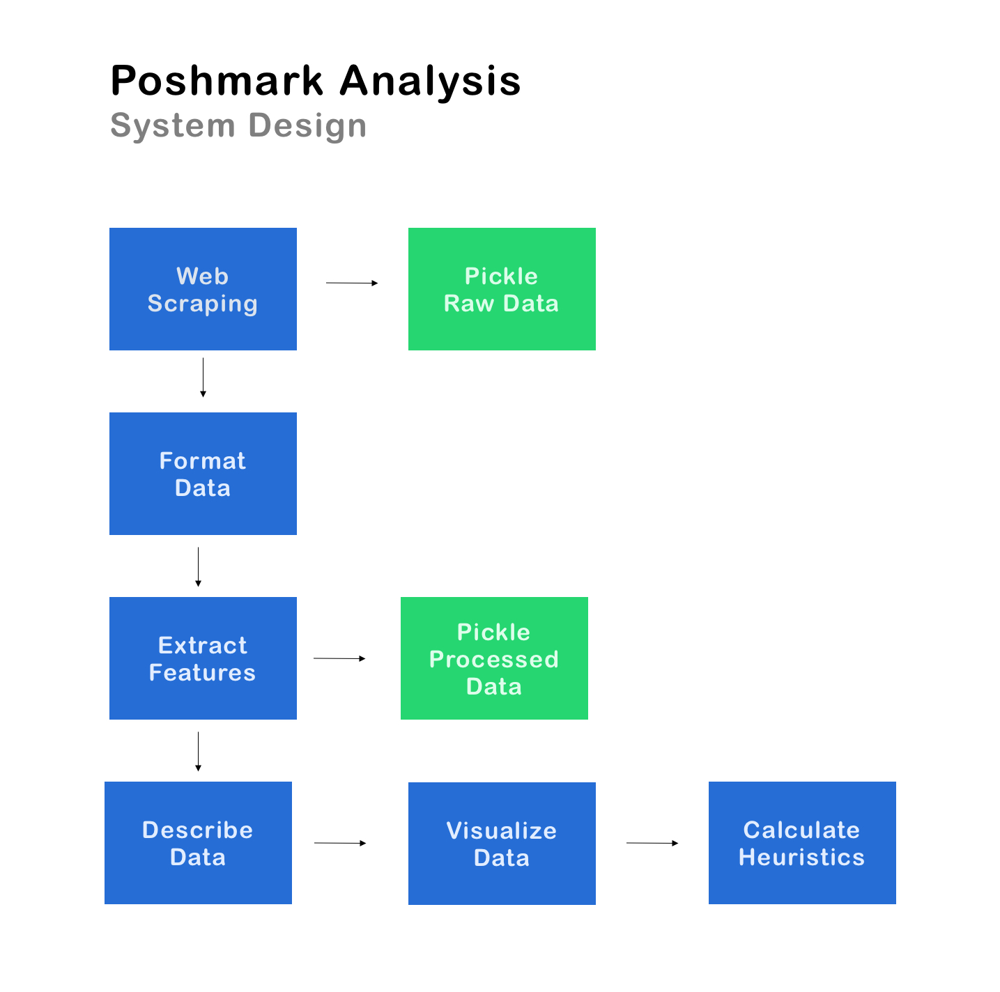

# Poshmark Analysis

## Goal

Poshmark is a social commerce platform to buy new and used clothing. Currently listed items are discounted anywhere from 20-60% of retail price.

The app let's you offer and negotiate a lower price. I'd like to see what the average discount is per item type by examining current and past listings.

## MVP Pipeline

## Data Collection

The first step of the pipeline is to use web scraping to download the source html from Poshmark. Utilizing a headless browser here with Selenium helps avoid any rate limiting or IP blocking issues.

The second step is to use `BeautifulSoup` to parse and extract out the desired values such as item title, condition status, price, size and brand.

The raw data is stored in a pickle file to maintain a source of truth.

## Data Cleaning

Web scraping extracts all the values as strings. We would like the size and price to be integers. The next step is to use Python to format certain values.

We can also extract additional features from the values, such as the number of days listed and creating boolean flags for the condition and stock status.

The processed data is stored in a `pickle` file to maintain a version of data for repeatable analysis.

## Data Exploration

The next step is to use `pandas` to examine the data and look at descriptive statistics.

We can separate the data into 2 dataframes. One for all the data points and one for only numeric values.

With the numerical data, we can use `matplotlib` to examine the distribution of numeric values by brand, such as price and days listed.

## Basic Heuristics

Instead of creating a basic predictive model, we can use basic heuristics.

We can look at the price of current listings vs the price of past listings. The past listing price is actually the price after negotiations. I verified this based on my personal transaction history.

The output is a chart that shows the average discount price per brand. This is a starting point for recommending how much to offer when negotiating.
